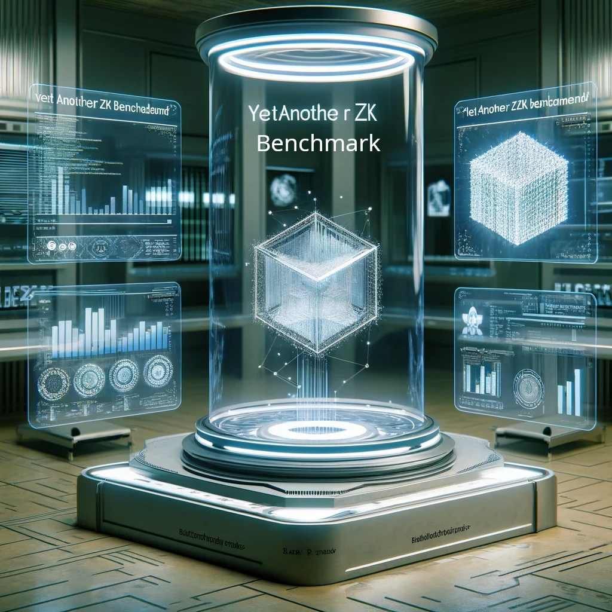

  <em>Yet Another ZK Benchmark</em>
  
   
  <a href="https://mjzk.xyz/yazkb/"><em>Read the benchmark report</em></a>

The YAZKB (Yet Another Zero Knowledge Benchmark) project aims to offer an end-to-end, cutting-edge, and production-focused perspective by providing a unified, open and contemporary performance evaluation of the key zero-knowledge libraries, frameworks, and virtual machines.

# Features

The main distinctions of this benchmark compared to other ZK community benchmarks are:

## Opinionated

Based on the results of our benchmarks, we provide evaluative reports with a clear stance. The purpose of a benchmark is to guide developers in understanding the latest advancements in the field of ZK performance engineering, thereby identifying appropriate technological paths. We encourage open discussion rather than no-commented codes.

## End-to-End

From a production standpoint, the unit of system should be benched end-to-end. Our benchmarks are based on the perspective of user's usage, rather than the system's components (such as front-end or back-end). Furthermore, one advantage of this approach is that all supported zero-knowledge libraries, frameworks, zkvms and even zkevms can be benched together as long as they fulfill the same specific tasks.

## Interdisciplinary

The author is an expert who has worked in the fields of DB, AI, and languages for a long time. He believes that his past experience can provide ZK community with some unique perspectives on the evolution of the ZK framework.

## Up-to-Date

We assess the latest developments in ZK performance engineering with a forward-looking perspective. Projects or technologies that were popular last year may no longer be maintained this year. This benchmark hopes to keep pace with the times!

